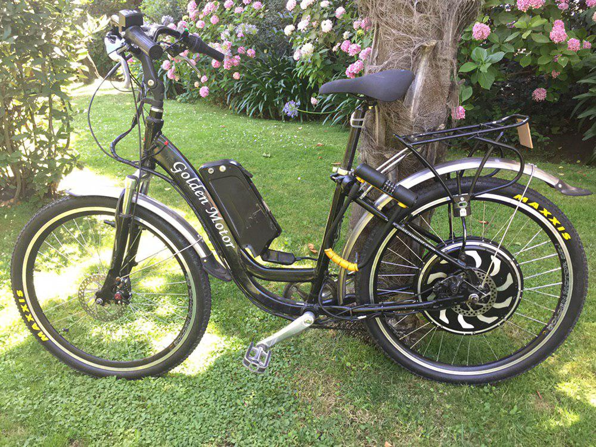

# Rosita's adaptive cruise control
## Rosita is my ebike, and she deserves an adaptive cruise control. Let's make it

## Pendings
### A list
- Shop list
 - [Sallen-Key Low-pass Filter](http://sim.okawa-denshi.jp/en/OPseikiLowkeisan.htm)
 - Speed sensor
 - Buzzer
- Make a provisory mount
- test power from bike
- make wiring diagrams / plans, considering:
 - parallel and altenate modes for manual throttle and cruise control
 - breaks reading and writting
 
### B list
 - Arduino app
  - add breaking
  - add speed reading
 - Add a laser in case that radar direction is hard to figureout

### C list
 - Go to Chimbarongo and buy a wicker basquet
 - Order parts for navegator companion

## Hardware used
 - [OPS243-C FMCW and Doppler Radar Sensor](https://omnipresense.com/product/ops243-c-fmcw-and-doppler-radar-sensor/)
 - [Arduino Mega 2560](https://store.arduino.cc/usa/mega-2560-r3)

## Saferity check list

### On arduino
 - What happen if serial connection to radar is lost?
 - What happen if serial read is not valid?
 - What happen if serial read takes longer than expected?
 
 
## Navigator companion
It's a sub-proyect focused mainy on displaying live info to the human (me), so main hardware can be fast, stable and realiable.

### Hardware
 - [Adafruit PyPortal Titano](https://www.adafruit.com/product/4444)
 - a GPS module
 
### features
 - Display current speed
 - Display battery charge
 - Calculate and display battery range
 - Log trips